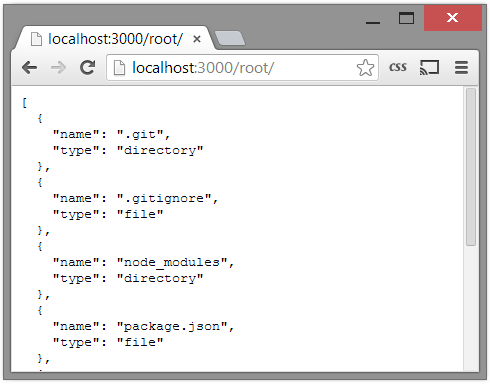

floppy
======

**floppy** is a tool to securely access your harddrive, effectively creating your own private cloud. This document could be considered both actual documentation and a tutorial. I'm sure I will eventually come up with a better introduction so let's jump right in.

### Table of Contents
- [Technologies](#00-technologies)
- [Serving](#10-serving)
- [Serving the File System](#20-serving-the-file-system)
- [Detailing the Directory](#30-detailing-the-directory)
- [Client Model](#40-client-model)
- [Angular Connection](#50-angular-connection)

## 0.0 Technologies
**floppy** can be used from any web browser, but it is more than just a web page. **floppy** would better be described as a file server. We will use [Node.js](http://nodejs.org) and a node module [Express](http://expressjs.com) to implement this service. On the web page side a mix of jQuery, Bootstrap, and AngularJS will power an intuitive interface.

## 1.0 Serving
In this chapter we create a simple web server that is mapped onto your filesytem using a chosen root directory. This system will make up our **floppy** server. When accessing our server, any URL that is down the `root/` path we should handle the HTTP request in two ways.

1. If the URL maps to a file, let the client download the desired file.
2. If the URL maps to the directory, return a JSON file containing the contents of the directory.

### 1.1 Setting up Node
[Node.js](http://nodejs.org) will be our server backend in **floppy**. Node is still in a very preliminary stage of development, and really isn't recommened for use in production environments. However, I believe Node is an amazingly innovative networked application framework and it is worth learning about, it will only get better. Node itself is easy to setup, just head to the [Node.js website](http://nodejs.org) and install Node. Be sure to also install `npm` the Node Package Manager.

After installation, using Node is as easy as starting up an instance of the Node.js command prompt. This terminal will give you access to Node utilities such as running programs and the Node package manager `npm`.

### 1.2 Setting up Express
[Express](http://expressjs.com) is a web application framework that we will use to easily create our file serving API. We will create a super simple Express application that will be our foundation for the **floppy** server.

Inside a Node.js command prompt, create a folder for the **floppy** server and navigate inside.
```shell
mkdir floppy-server
cd floppy-server
```
From here we will create our package description for our Node.js application. Copy the below configuration to `package.json`.
```json
{
	"name": "floppy-server",
	"description": "serves up your floppy",
	"version": "0.0.1",
	"dependencies": {
		"express": "3.*"
	}
}
```
The above is mostly self explanatory, with basic application information and a declaration that Express is a dependency. It is recommended to replace `"3.*"` with the most recent Express version, which can be found with `npm info express version`. At the time of writing, this was `3.5.1`.

Now to install our application dependencies, from the Node.js command prompt enter,
```shell
npm install
```
This will install Express and its own dependencies. The next step will finally involve code. We will create a simple Express instance that will basically be our hello world application.

We first create a file in our `floppy-server` directory named `server.js`. Inside we first `require(1)` Express and then create an instance (`require(1)` is similar to a Java or C `import`)
```javascript
var express = require('express');
var app = express();
```
We will now set up a route to respond to all HTTP requests. HTTP requests come with a request method, you may have heard of `GET` and `POST` from different ways to submit parameters to a webpage, but there are also others like `PUT` and `DELETE`. We can respond to these different request methods in different ways. For now we will respond to all HTTP request methods, this accounts for the `app.all(2)` call. The first argument is the URL we want to map, `'*'` is a wildcard to catch all URLs. We then use the Express [`Response`](http://expressjs.com/3x/api.html#res) object to send a simple HTML message back to the client in the callback.
```javascript
// respond to all HTTP requests
app.all('*', function(req, res) {
    res.send('Hello <strong>floppy</strong> user!');
});
```
The last step is to start the Express web server. This is a call to `app.server(2)` that opens a socket on the requested port. We also log to the console on success.
```javascript
// start listening for HTTP requests
var server = app.listen(3000, function() {
    console.log('Listening on port %d', server.address().port);
});
```
The last step is to run the server. Return to the Node.js command prompt and your working directory and enter,
```shell
node server
```
You should receive a message that the server is running on port 3000. Open up your favorite browser and navigate to [http:\\\\localhost:3000](http:\\localhost:3000). You should be greeted by your friendly greeting. Note that any URL you enter will result in the same response from the server.


For a more in-depth tutorial on Express and routes I would recommend [Introduction to Express](http://code.tutsplus.com/tutorials/introduction-to-express--net-33367).

[View Commit](https://github.com/colinbrownec/floppy-server/commit/8f639aaedbcab9c4f26f158d6b9f66e74b44afc2)

## 2.0 Serving the File System
Now that we have a simple server, we want to have it return some useful information. We will now change our Express server to return results based on URL. The first thing to do is replace the `app.all(2)` with `app.get(2)`. Both calls are part of the `app.VERB(2)` routing commands where `VERB` is the matching HTML request method. We now only care about `GET` request methods since we will be implementing procedures to read data.

### 2.1 Finding the Path
Usually Express is used to narrow down what function to call be setting up various routes and using paramters. We really don't need specific routes and parameters, our one paramter is the URL path. But to make sure we can add more routes later we will route the URL `/root/` to our application.

We place the following code in a new file `floppy-server/routes/floppy.js`,
```javascript
exports.parse = function(req, res) {
    res.send(req.params[0]);
};
```
This is a Node.js module package that basically acts as a class definition. We import our newly created module in `server.js`,
```javascript
var express = require('express');
var floppy = require('./routes/floppy');

var app = express();

// respond to all HTTP GET requests in /root/
app.get('/root/*', function(req, res) {
    floppy.parse(req, res);
});

// start listening for HTTP requests
var server = app.listen(3000, function() {
    console.log('Listening on port %d', server.address().port);
});
```
The `require(1)` statement creates an instance of our floppy module which we save in a variable named `floppy`. Running the application will now start a server that echoes any URL that is down the `/root/` path. Note that `/root/` is already removed from the current path. 

### 2.2 Parsing the Path
We can now further develop our `floppy.parse(2)` method to implement our file server. Below is our updated `routes/floppy.js` file.
```javascript
var fs =    require('fs');
var path =  require('path');

var root = './';   // floppy mapped file system root

// sets the root of the floppy server
exports.root = function(newroot) {
    root = newroot;  
};

// parse a url and respond with either the file or directory information
exports.parse = function(req, res) {
    var url = path.resolve(root + req.params[0]);
    
    /* calls are synchronous to immediately handle this request */
    
    // validate path and do a simple stat
    if (fs.existsSync(url)) {
        var stat = fs.statSync(url);
        
        // if it is a file return the actual file
        if (stat.isFile()) {
            res.download(url);
        }

        // if it is a directory return the contents
        if (stat.isDirectory()) {
            var dir = fs.readdirSync(url);
            res.send(dir);
        }
        
    // else file does not exist and we respond with an error
    } else {
        var error = { 'error': 404 };
        res.send(error);
    }
};
```
There is much new functionality. We first also include the Node modules [`fs`](http://nodejs.org/api/fs.html), which provides many file system methods, and [`path`](http://nodejs.org/api/path.html) which resolves URL's to make sure the are safe and accurate. We also have a `root` variable that is a floppy-relative (or explicit) path that we want `/root/` to map to. We also provide a mechanism to update this root via `floppy.root(1)`.

The largest changes are in the `floppy.parse(2)` implementation. Given a URL we check to see if it is valid; if it is we either return the file requested, or return an array of file names if it is a directory. If the URL requested is bad then we return an error message.

Run the application again. Using a browser, any URL in the `localhost:3000/root/` directory should either result in a directory listing or in a file download.


If you are experienced with Express, you may be thinking that it really isn't needed to do this. You would be correct, this is much too simple to need Express. However the scope of this project is large, and we will eventually want to handle different routes and HTTP request methods. So this is a good place to start.

[View Commit](https://github.com/colinbrownec/floppy-server/commit/f34b175c12957704c6fff4111a3249f4e0daf63f)

## 3.0 Detailing the Directory
Our handling for files right now is great, you ask for the file, we give it to you. Handling a directory could still use some work. For now we will use the following json structure to return the contents of a directory, where each directory item is a new object in the array.
```json
[
  {
    "name": "a_file.txt",
    "path": "/a_file.txt",
    "type": "file"
  },
  {
    "name": "more_files",
    "path": "/more_files",
    "type": "directory"
  },
]
```
Below is the modified code that returns the response to a directory HTTP `GET` request.
```javascript
...
        // if it is a directory return the contents
        if (stat.isDirectory()) {
            var dir = fs.readdirSync(url);
            var results = [];
            
            // loop through directory and stat each file
            for (var i = 0; i < dir.length; i++) {
                var name = dir[i];
                var fstat = fs.statSync(path.resolve(url, name));
                
                var file = { 'name': name,
                             'path': '/' + name,
                             'type': fstat.isFile() ? 'file' : 'directory'
                           };
                results.push(file);
            }
            
            // send back detailed directory
            res.send(results);
        }
...
```
This really shouldn't seem that different. Instead of just returning our array of directory contents, we first stat each file to learn more about it. We then return this aggregated information.



[View Commit](https://github.com/colinbrownec/floppy-server/commit/039b4991f7719551d28ffac7e7d6901f1c58f892)

## 4.0 Client Model
The **floppy** client is a separate web application that must know how to connect to a floppy server. 
We will be using AngularJS which is an amazing implementation of the Model-View-Controller architechture.
I view the `.html` as the model, `.css` as the view and `.js` as the controller. 
This could be said about libraries like jQuery, but AngularJS is special because it provides two way data binding.
Two way data binding allows you to bind a variable to an input box, and when the input value changes the variable updates and when the variable changes the input box updates.

### 4.1 Layout
Before we start making a functional client we need to know what the client will look like.
To do this I use Twitter's Bootstrap for basic data organization. 
To begin with we use Bootstrap's `breadcrumb` for to represent our current working directory.
```html
<!-- navigation bar for file system -->
<nav>
<ol class="breadcrumb" id="breadcrumb">
    <li><a href="#">root</a></li>
    <li><a href="#">folder</a></li>
    <li class="active">sub-folder</li>
</ol>
</nav>
```
We also use a `list-group` to organize a listing of the directory's contents.
```html
<!-- list of directory contents -->
<div class="list-group" id="links">
    <a href="#" class="list-group-item">item 1</a>
    <a href="#" class="list-group-item">item 2</a>
    <a href="#" class="list-group-item">item 3</a>
    <a href="#" class="list-group-item">item 4</a>
</div> 
```
There really isn't much to show off at this point, so we also include some static html content.
You might ask why we bother including any fake content at all; 
besides letting me show you this pretty picture,
it also provides the perfect template to make in AngularJS.


[View Commit](https://github.com/colinbrownec/floppy-client/commit/4446c784eaf6f562c9cc74001060c2609f0f8e3f)

## 5.0 Angular Connection